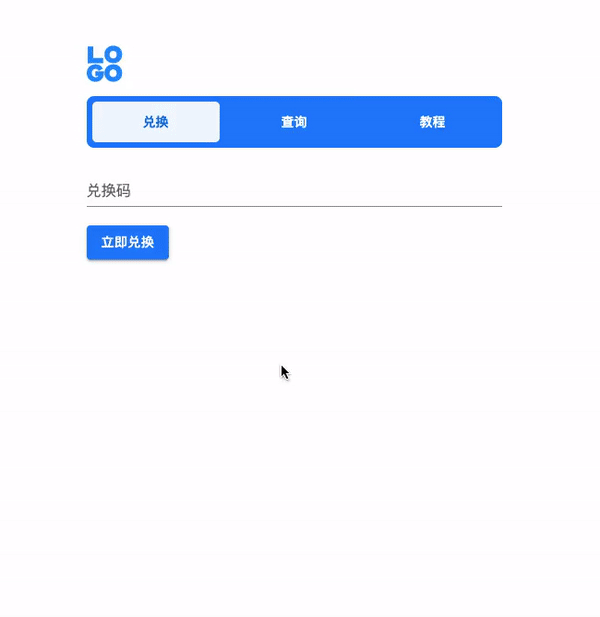
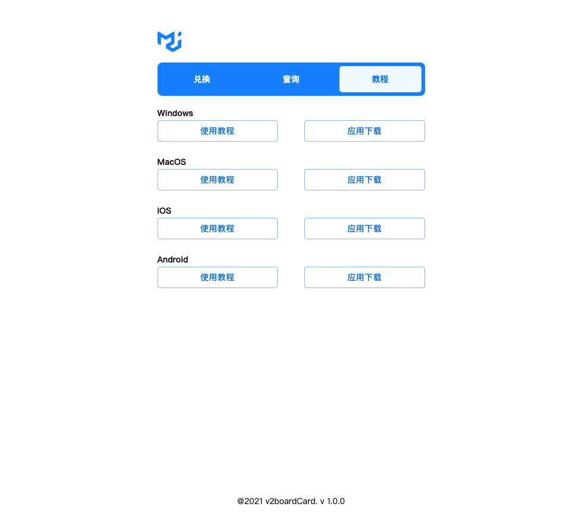

# v2board card 🍭

```
免责声明:
此库仅本人个人学习开发并维护, 不保证任何可用性。
有问题 提issue
( 悠悠的 baby..🌹 Try it!!! )

  喜欢🥰 就用你的小jiojio 点一个 ⭐️ Star ! thank you. ->
```

- [写代码很容易，写成一坨~😶‍🌫️.. 能用即可](https://github.com/trekhleb/state-of-the-art-shitcode)
- 如果并不合您,请自行用❤️发电！

### 交流群

[Telegram](https://t.me/miyauulab_Chat)


### UU说~
```
请自行衡量... 它的用途

可与v2board面板分开 独立部署在一台机器

其他功能 点一个 ⭐️ Star ! thank you. -> 后续再更新...  不给我点星星我会没有信心继续下去...

大哥哥大姐姐🥱 不要喷wo, y～
```
#
### 预览
功能是参考别人的🥶...





## 如何使用？
```shell
在admin 后台生成 对应套餐的 优惠券 可以一键批量生成导出 k大写了这个功能 

#示例配置:
   a套餐 月付30元 
   
# 后台生成 
  30元的优惠券 按照金额折扣 设置当前一个套餐可用
  
#使用次数
  最低1次 反正你多了我也只能用一次 用完就清零了🥶 
  
#开始和结束时间 
  自行调整
  
#当套餐两个相同金额 
 会匹配 最前面的一个 月 季 半年 年 两年 三年 这样..

#关于账号 
  会生成账号 但是用户看不到
  
#账号的格式是
  优惠码+兑换时间戳+@配置文件配置的自定义后缀 
  xxxx1234567890@xxxx.com 这个样子的 👗
  
#初始密码 
  配置文件自定义初始密码 
  兼容原版 v2board面板可直接登入 
  ps: 没有设置密码偏移量 否则登入不了 估计密码错误.没试!🥶
  
```


## 如何部署?

### 自行编译
```
不用我这个小菜菜 🪖教学了...
```

### 还是使用pm2部署吧 简单点
[下载构建版本](https://github.com/MiyaUU/v2board-card/releases)

```shell
# 安装 pm2 
npm install pm2 -g

配置文件有两个

--- v2board-card.yaml

database:
  host: "localhost"        # 数据库地址 本地 或 ip
  port: 3306               # 数据库端口
  name: "v2board"          # 数据库名称
  username: "root"         # 数据库用户名
  password: "root"         # 数据库密码

service:
  port: 8082  # 服务运行端口 需要与前端一致
  email_suffix: "uuCard.com" # 用户邮箱后缀 生成出来的邮箱格式 兑换码+时间戳+自定义后缀
  password: "1234567890"     # 账户默认密码 v2board原版无偏移值 可直接登入
  subscribe_url: "https://xxxxxx.com" # 订阅地址 不要加 /

--- config.js 

window.config = {
  macos_doc_url: '教程tab 文档链接',
  macos_app_url: '教程tab 下载链接',  # 下面的 doc_url 和 app_url 都是一样的 
  windows_doc_url: '',
  windows_app_url: '',
  ios_doc_url: '',
  ios_app_url: '',
  android_doc_url: '',
  android_app_url: '',
  footer: `@2021 v2boardCard. v1.0.0`, # 网站底部信息
  logo: './logo.svg',  # logo的地址 可以远程 本地的话根目录 就是 ./ 
};

# 修改 nginx 配置文件 
server 模块下 添加

location /api/v1/card {   # 访问路径匹配规则
           proxy_pass http://localhost:8082;  # 端口是服务端配置的端口
        } 


改完保存

# 运行
pm2 start v2board-card
pm2 log v2board-card 看到小帽子 就运行起来了
       .---_
      / / /\|
     / / | \ *
    /  /  \ \
   / /  / \  \
 ./~~~~~~~~~~~\.
( .",^. -". '.~ )
 '~~~~~~~~~~~~~'  

ps.. 如果运行不了 请赋予它权限 🍭

```
